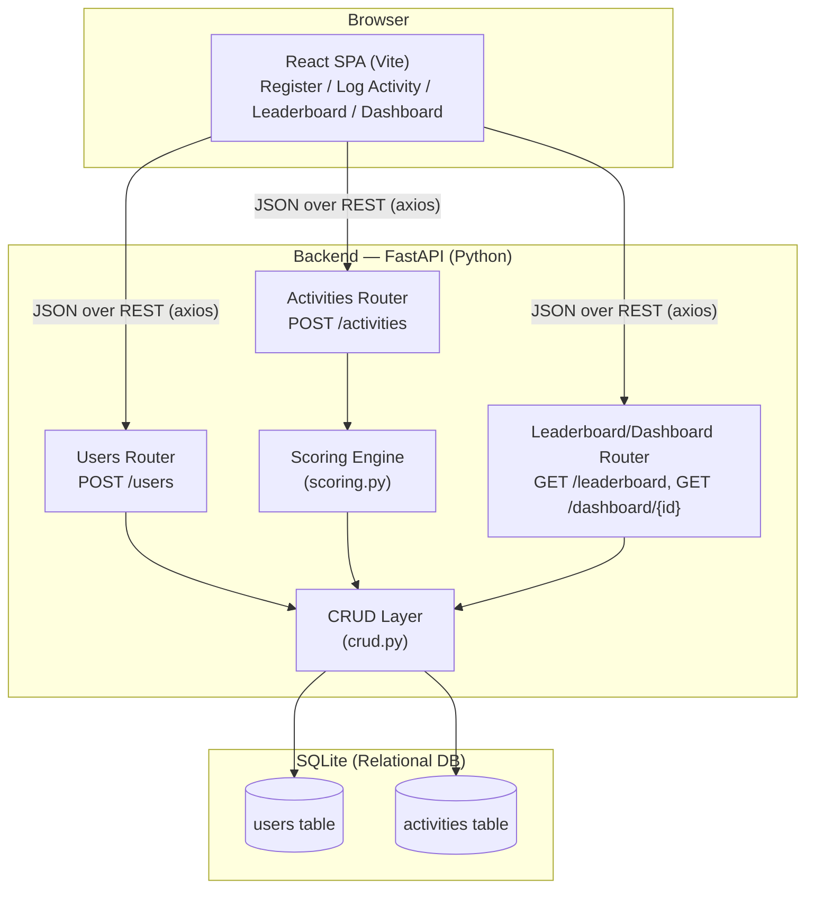

# Fitness Challenge — Design Document

## a. System Architecture & Data Flow

### High-level architecture



**Stack:**
- **Frontend:** React (Vite), React Router, Tailwind CSS, Recharts, Axios.
- **Backend:** Python, FastAPI, Pydantic (validation), SQLAlchemy (ORM).
- **Database:** SQLite (single-file relational DB — trivially portable, zero setup, sufficient for this scope; the ORM abstraction means swapping to Postgres later is a one-line connection-string change).

The frontend never talks to the database directly — every read/write goes through the FastAPI REST layer, which validates input via Pydantic schemas before it reaches business logic.

### Request/response flow — User Registration

1. User submits the registration form (`first_name`, `last_name`, optional `email`) from the React app.
2. `POST /users` request hits the **Users Router**.
3. Pydantic (`UserCreate` schema) validates the shape/types of the payload — malformed JSON is rejected automatically with `422`.
4. The router queries the DB (case-insensitive match on `first_name` + `last_name`).
   - If a match exists → respond `409 Conflict`, no row written.
   - If no match → insert a new `users` row (DB-level `UNIQUE` constraint is the final safety net against race conditions), and return `201 Created` with the generated `userId`.
5. Frontend stores the returned user object (in `localStorage`) to keep the user "signed in" across page refreshes, and redirects to the leaderboard.

### Request/response flow — Activity Data Ingestion

1. User fills in the activity form (sport + sport-specific value) from the React app. The frontend maps the selected sport to its required `metric_type` automatically (e.g. selecting "Running" locks in `distance_km`), so a well-behaved client can't send a mismatched pair — but the backend re-validates independently since it must never trust the client.
2. `POST /activities` hits the **Activities Router** with `{ userId, sport, metric_type, value }`.
3. Pydantic validates types/enum membership (`sport` and `metric_type` must be one of the defined enum values, `value` must be `> 0`) — invalid shapes get `422` automatically.
4. The router checks, in order:
   - **User exists?** → `404 Not Found` if not.
   - **Does `metric_type` match what this `sport` requires** (via `SPORT_METRIC_MAP`)? → `400 Bad Request` if not (e.g. `sport: running` with `metric_type: steps`).
5. If valid, the **Scoring Engine** computes `points` from the raw value using the flooring rules (see section d).
6. The CRUD layer persists a new `activities` row (raw value **and** computed points, so history stays auditable if scoring rules ever change).
7. Response: `201 Created` with the full activity record including computed `points`.
8. The Leaderboard and Dashboard endpoints (`GET /leaderboard`, `GET /dashboard/{userId}`) are pure read/aggregation operations over the `activities` table — no separate leaderboard table is maintained (see section b).

---

## b. Database Schema & Data Model

### `users` table

| Column       | Type     | Constraints                              |
|--------------|----------|-------------------------------------------|
| `id`         | String (UUID) | Primary Key                          |
| `first_name` | String   | Not Null                                  |
| `last_name`  | String   | Not Null                                  |
| `email`      | String   | Nullable                                  |
| `created_at` | DateTime | Default: current UTC time                 |

**Duplicate-user enforcement strategy:** a composite `UNIQUE(first_name, last_name)` constraint at the database level (`uq_user_first_last_name`), combined with an application-level case-insensitive pre-check before insert. The DB constraint is the source of truth — it protects against race conditions (two simultaneous registration requests for the same name) that an application-level check alone could miss; the pre-check exists purely to return a clean `409` with a helpful message instead of a raw DB integrity error.

### `activities` table

| Column         | Type          | Constraints                                          |
|----------------|---------------|-------------------------------------------------------|
| `id`           | String (UUID) | Primary Key                                           |
| `user_id`      | String (UUID) | Foreign Key → `users.id`, Not Null, Indexed           |
| `sport`        | Enum          | Not Null (`running`, `walking`, `cycling`, `gym`, `swimming`, `daily_steps`) |
| `metric_type`  | Enum          | Not Null (`distance_km`, `duration_sec`, `steps`)     |
| `raw_value`    | Float         | Not Null — the value as submitted (km, seconds, or step count) |
| `points`       | Integer       | Not Null — computed, floored points for this entry    |
| `activity_date`| DateTime      | Indexed, defaults to submission time if not provided  |
| `created_at`   | DateTime      | Default: current UTC time                             |

**Why store `raw_value` *and* `points`, instead of recomputing on read:** this makes historical activity records auditable and immune to silent corruption if the scoring formula changes later — old entries keep the points they were awarded at logging time, while new entries use the current formula.

### "Leaderboards" — deliberately not a stored table

The leaderboard is **computed on read** from `activities` (grouped `SUM(points)` per user), not persisted as its own table. Rationale: a stored leaderboard table would need to be kept in sync with every activity insert/update/delete, introducing a second source of truth that can drift. Computing it on read from the single source of truth (`activities`) trades a small amount of read-time aggregation cost for correctness-by-construction — and at this data scale, that aggregation is inexpensive. The 7-day trend is computed the same way, by re-running the aggregation with a `activity_date <= now - 7 days` filter and comparing the resulting rank to the current one.

### Entity relationship

```
users (1) ────< (many) activities
   id  ────────────────  user_id (FK)
```

---

## c. API Specifications

### `POST /users` — User Registration

**Request body:**
```json
{
  "first_name": "Jane",
  "last_name": "Doe",
  "email": "jane@example.com"
}
```

**Validation rules:**
- `first_name`, `last_name`: required, string, 1–50 characters.
- `email`: optional, must be a valid email format if provided.
- Combination of `first_name` + `last_name` (case-insensitive) must not already exist.

**Responses:**

| Status | When | Body |
|--------|------|------|
| `201 Created` | Registration succeeds | `{ userId, first_name, last_name, email, created_at }` |
| `409 Conflict` | Name already registered | `{ "detail": "A user named 'Jane Doe' is already registered." }` |
| `422 Unprocessable Entity` | Missing/malformed fields (e.g. missing `last_name`, invalid email format) | FastAPI's standard validation-error body |

### `POST /activities` — Activity Data Ingestion

**Request body:**
```json
{
  "userId": "a1b2c3d4-...",
  "sport": "walking",
  "metric_type": "distance_km",
  "value": 1.55,
  "activity_date": "2026-09-01T10:00:00Z"
}
```

| Field | Type | Notes |
|---|---|---|
| `userId` | string | Must reference an existing user |
| `sport` | enum | `running` \| `walking` \| `cycling` \| `gym` \| `swimming` \| `daily_steps` |
| `metric_type` | enum | `distance_km` \| `duration_sec` \| `steps` |
| `value` | float | Must be `> 0`. Meaning depends on `metric_type`: kilometers, seconds, or step count respectively |
| `activity_date` | datetime | Optional — defaults to submission time |

**Validation rules:**
- `sport` and `metric_type` must each be a recognized enum value → otherwise `422`.
- `metric_type` **must match** the sport's expected metric (via a fixed sport→metric map) → otherwise `400 Bad Request`. Example: `sport: running` requires `metric_type: distance_km`; sending `metric_type: steps` for running is rejected.
- `value` must be greater than 0 → otherwise `422`.
- `userId` must correspond to an existing, registered user → otherwise `404 Not Found`.

**Responses:**

| Status | When | Body |
|--------|------|------|
| `201 Created` | Activity logged successfully | `{ id, userId, sport, metric_type, raw_value, points, activity_date }` |
| `400 Bad Request` | `metric_type` doesn't match `sport` | `{ "detail": "Invalid metric_type 'steps' for sport 'running'. Expected 'distance_km'." }` |
| `404 Not Found` | `userId` doesn't exist | `{ "detail": "No user found with userId '...'." }` |
| `422 Unprocessable Entity` | Malformed schema (bad enum value, missing field, non-positive value) | FastAPI's standard validation-error body |

### Supporting read endpoints (for the frontend)

- **`GET /leaderboard`** → array of `{ rank, userId, first_name, last_name, total_points, points_7_days_ago, rank_7_days_ago, trend, rank_change }`, sorted by `total_points` descending.
- **`GET /dashboard/{userId}`** → `{ userId, first_name, last_name, total_points, current_rank, activity_history[], points_over_time[], sport_breakdown[] }`. Returns `404` if the `userId` doesn't exist.

---

## d. Scoring & Normalization Logic

Implemented in `backend/app/scoring.py` as pure, dependency-free functions (no DB or HTTP calls), so the rules can be unit-tested in isolation.

### Conversion rates

| Sport | Metric | Rate |
|---|---|---|
| Running | 1 km | 100 points |
| Walking | 1 km | 50 points |
| Cycling | 1 km | 25 points |
| Swimming | 1 minute | 15 points |
| Gym | 1 minute | 5 points |
| Daily Steps | 100 steps | 1 point |

### Flooring rules (implemented exactly as specified)

**Distance sports (running / walking / cycling):** points scale linearly with distance; the **final points value** is floored (the distance itself is not floored first).
```
points = floor(distance_km × rate_per_km)
```
Example: 1.55 km walking → `1.55 × 50 = 77.5` → floored → **77 points**.

**Duration sports (gym / swimming):** only fully completed minutes count. The duration (submitted in seconds) is floored to whole minutes **before** multiplying by the rate.
```
whole_minutes = floor(duration_seconds / 60)
points = whole_minutes × rate_per_minute
```
Example: 1 minute 55 seconds (115s) of gym → `floor(115/60) = 1` whole minute → `1 × 5 = 5 points`.

**Daily Steps:** only fully completed blocks of 100 steps count. Steps are floored to the nearest hundred **before** dividing by 100 and applying the rate.
```
whole_hundreds = floor(steps / 100) × 100
points = (whole_hundreds / 100) × rate_per_100_steps
```
Example: 399 steps → `floor(399/100)×100 = 300` → `300/100 = 3` → **3 points**.

All three rules were verified against the exact worked examples given in the assignment spec before integration into the API (1.55 km walking → 77, 399 steps → 3), and again end-to-end through the live API during manual testing.

---

## e. Frontend Architecture & Visualizations

### Component breakdown

```
frontend/src/
├── App.jsx                      — router, session state, page-transition wrapper
├── api/client.js                — thin Axios wrapper around every backend endpoint
├── pages/
│   ├── Home.jsx                 — marketing/landing page; shows a sample
│   │                              leaderboard preview and CTA buttons into every
│   │                              other page for unauthenticated visitors
│   ├── Register.jsx / SignIn.jsx
│   ├── LogActivity.jsx          — wraps ActivityForm
│   ├── Leaderboard.jsx          — wraps LeaderboardTable; gated for signed-out visitors
│   └── Dashboard.jsx            — wraps stat cards + TrendChart + SportBreakdownChart
├── components/
│   ├── Navbar.jsx / Footer.jsx / Logo.jsx
│   ├── ActivityForm.jsx         — per-sport input UX (distance / mm:ss / step count)
│   ├── LeaderboardTable.jsx     — rank, name, points, 7-day trend arrow
│   ├── TrendChart.jsx           — Recharts area chart, points-over-time
│   ├── SportBreakdownChart.jsx  — Recharts donut chart, points-per-sport
│   ├── AnimatedBackground.jsx   — cursor-reactive radial-gradient background
│   ├── PageLoader.jsx           — brief buffer shown between route transitions
│   ├── PreviewGate.jsx          — blurs/dims a page's real content and overlays a
│   │                              Register/Sign In prompt for signed-out visitors
│   └── visuals/
│       ├── SportVisual.jsx      — per-sport illustration (replaces plain emoji)
│       └── FeatureVisual.jsx    — landing-page feature illustrations
```

### Global Leaderboard

`Leaderboard.jsx` calls `GET /leaderboard` and renders the response through `LeaderboardTable.jsx`. When the visitor isn't signed in, the page wraps the table in `PreviewGate`: real (sample) leaderboard data renders underneath, blurred and non-interactive, with a card on top prompting registration/sign-in — this lets a prospective user see exactly what the feature looks like before committing to an account, rather than hiding it behind a wall entirely.

**Ranking calculation strategy:** ranking is never computed in the frontend — the frontend only renders whatever order `GET /leaderboard` returns. This keeps ranking logic in one place (the backend, see section b) and guarantees the leaderboard a user sees always matches what any other client (mobile app, another browser tab) would see for the same data.

### Personal Dashboard

`Dashboard.jsx` calls `GET /dashboard/{userId}` once and distributes the single response across three visual pieces:
- Two scoreboard-style stat cards (total points, current rank) — direct fields from the response, no client-side computation.
- `TrendChart.jsx` — Recharts `AreaChart` fed directly by `points_over_time[]`; the backend has already grouped points by calendar day, so the frontend only needs to plot.
- `SportBreakdownChart.jsx` — Recharts `PieChart` (donut) fed by `sport_breakdown[]`, again pre-aggregated server-side.

Same as the leaderboard, the dashboard is wrapped in `PreviewGate` for signed-out visitors, showing a blurred sample of what a real dashboard looks like.

### Interaction & motion design

- Route changes use `framer-motion`'s `AnimatePresence` for a short fade/slide transition (`App.jsx`), plus a brief `PageLoader` buffer so navigation never feels instantaneous-to-the-point-of-jarring.
- `AnimatedBackground.jsx` tracks pointer position and updates a CSS custom property consumed by a radial-gradient background, giving the page subtle depth without any heavy WebGL/canvas dependency.
- All interactive elements (buttons, cards, table rows) use Tailwind transition utilities for hover/active feedback (scale, shadow, color) rather than one-off inline styles, keeping the motion language consistent across the app.

---

## f. Trade-offs & Edge Cases

### Trade-offs

| Decision | Trade-off accepted | Why |
|---|---|---|
| SQLite instead of Postgres/MySQL | No built-in support for concurrent writers across multiple processes; single-file storage | Matches the assignment's recommended scope; SQLAlchemy's ORM abstraction makes swapping the connection string to Postgres a non-breaking change later |
| Leaderboard computed on read, not cached/stored | Every `GET /leaderboard` call re-aggregates all activities for all users | Avoids a second source of truth that could drift from actual activity data (see section b); acceptable at this data scale, and straightforward to add caching (e.g. a short TTL cache) later without changing the API contract |
| Identity = first + last name (no password auth) | Anyone who knows a user's name can "sign in" as them via the lookup endpoint | Explicitly out of scope per the assignment (no auth system requested); the same identity rule is used consistently for both duplicate-detection at registration and "sign back in," so there's no separate, weaker rule introduced for convenience |
| Points stored on the activity row rather than recomputed from `raw_value` on every read | Slightly more storage; a bug in `scoring.py` before a fix won't retroactively correct already-stored points | Historical auditability — a user's past activity should show the points they actually earned at the time, not be silently rewritten if scoring logic changes |
| CORS wide open (`allow_origins=["*"]`) | Not production-safe as-is | Appropriate for local development against a dynamic Vite port; a real deployment would lock this to the deployed frontend's origin |

### Edge cases handled

- **Concurrent duplicate registration** — two simultaneous `POST /users` requests for the same name could both pass the application-level pre-check before either commits. The database-level `UNIQUE(first_name, last_name)` constraint is the actual guard: whichever request commits second fails at the database layer. (In the current implementation this raises a raw integrity error rather than a clean `409` in that narrow race window — a known limitation worth wrapping in a try/except around the insert if this were hardened further for production.)
- **Case sensitivity in names** — `"Jane Doe"` and `"jane doe"` are treated as the same identity for both duplicate-detection and sign-in lookup, via `func.lower()` comparisons — a visitor can't accidentally create a second account by capitalizing differently.
- **Invalid sport/metric combination** — explicitly validated and returns `400`, not `422`, distinguishing "well-formed but semantically wrong" from "malformed" per the spec's requirement.
- **Non-existent `userId` on activity ingestion** — returns `404` rather than silently creating an orphaned activity row or crashing on the foreign-key insert.
- **Zero-value or negative activity values** — rejected at the schema level (`Field(..., gt=0)`) before reaching the scoring engine, so `calculate_points` never has to handle nonsensical input.
- **Fractional edge cases in scoring** — verified against the two examples the spec gives explicitly (1.55 km walking → 77 points; 399 steps → 3 points), plus additional cases exercised manually through the live API (a duration of exactly 60 seconds, a distance of exactly 0.01 km) to confirm the flooring behaves correctly at boundaries, not just on "clean" inputs.
- **Empty leaderboard / empty dashboard** — both the frontend (empty-state messaging in `LeaderboardTable.jsx` and `Dashboard.jsx`) and backend (aggregation queries use `COALESCE(SUM(...), 0)` so a user with zero activities gets `0` rather than `NULL` or a query error) handle the no-data case explicitly rather than assuming at least one activity always exists.
- **Signed-out access to gated pages** — rather than a blank page or a hard redirect, `PreviewGate` shows real (sample) UI so a prospective user understands the value before registering.
